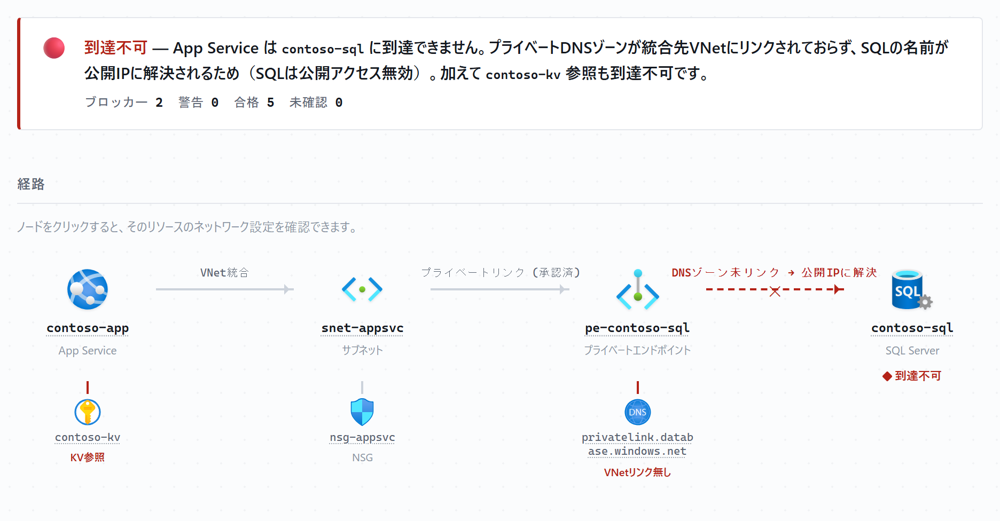
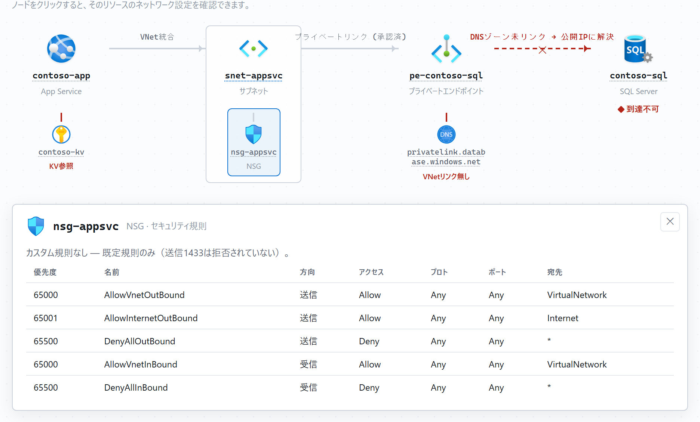

# azure-nettrace

[English](README.md) · 日本語

> ステータス: 開発中 🚧

単一の Azure リソースのネットワーク到達性をたどり、インタラクティブな HTML レポートと
して描く、Claude Code の Agent Skill 兼 GitHub Copilot のカスタムエージェントです。公式
Azure アイコンを使った配線図、到達性のブロッカー（赤信号）一覧、そして各リソースをクリッ
クすると設定が見られるインスペクタを備えます。

[Claude Code](https://claude.com/claude-code) と [GitHub
Copilot](https://github.com/features/copilot) の両方で動作します。診断ロジックは 1 つの
ナレッジベースを共有し、入口だけが異なります（[インストール](#インストール)参照）。

リソース名を 1 つ渡すと（App Service / VM / AKS / Function App / SQL Server /
ストレージ / API Management …）、次のように経路をたどります:

```text
リソース → VNet統合サブネット → NSG / ルートテーブル(UDR)
        → プライベートエンドポイント → プライベートDNSゾーン(VNetリンク)
        → 推定した接続先（アプリ設定 / 接続文字列 / Key Vault 参照から）
        → 接続先側のファイアウォール（networkAcls / publicNetworkAccess / DB FW規則）
```

…そして「何が繋がっているか」だけでなく、なぜ繋がらない可能性があるか（プライベート DNS
の VNet リンク欠落、NSG の拒否、未承認のプライベートエンドポイント、DB ファイアウォール
が統合サブネットを許可していない、等）まで示します。

## 見た目

レポートは結論を最初に置きます——「到達できるか、できないなら根本原因は何か」を 1 文で示し、
その下に左から右への配線図を描きます。断線箇所は赤で表示されます:

<picture>
  <source media="(prefers-color-scheme: dark)" srcset="docs/images/report-overview-ja-dark.png">
  
</picture>

配線図のリソースをクリックすると、その場でネットワーク設定を確認できます。下の例では NSG を
押してセキュリティ規則の表を開いており、疑わしいブロックをページを離れずに確認できます:

<picture>
  <source media="(prefers-color-scheme: dark)" srcset="docs/images/report-inspect-ja-dark.png">
  
</picture>

▶ 実際のレポートを触ってみる（サニタイズ済み `contoso-*` デモ・RF-04＋RF-06 の同じケース）:
<https://yukurash.github.io/azure-nettrace/demo/ja/> — ノードをクリックすると設定が開きます。

## 既存ツールとの違い

既存ツール（[azure-resource-visualizer](https://github.com/microsoft/azure-skills)、
Network Watcher トポロジ）はリソースグループやネットワーク全体を描きます。本ツールは別の
問いに答えます——「この 1 リソースが、なぜあの相手に繋がらないのか？」。単一リソース起点の
トレース・接続先推定・到達性診断を 1 つのレポートに融合しています。

## 特長

- 結論を最初に。「到達可否」と、不可なら根本原因を 1 文で提示します。
- 配線図に公式 Microsoft Azure アイコン（任意）。断線箇所は赤で表示します。
- リソースをクリックして設定を確認 — NSG ルール、サブネット構成、プライベートエンドポイントの
  状態、DNS の VNet リンク、SQL/ストレージのファイアウォール、他。
- 約 20 種類に専用アダプタ（App Service / Functions / VM / AKS / Container Apps /
  SQL・PG・MySQL / ストレージ・Key Vault・Cosmos / Redis / Service Bus・Event Hubs /
  ACR / AI Search / Foundry / API Management / Application Gateway / Front Door /
  Azure Firewall / Data Factory・Synapse …）。その他の型は汎用フォールバックで対応します。
- 出力言語 `en` / `ja`、ダーク/ライト対応、完全に自己完結（閲覧にネット不要）。

## 必要なもの

- Claude Code または GitHub Copilot（VS Code・エージェントモード）
- Azure CLI 2.60 以上でサインイン済み（`az login`）、`resource-graph` 拡張
- [Azure MCP サーバー](https://github.com/Azure/azure-mcp)（推奨。未設定なら Azure CLI に
  自動フォールバック）
- 対象サブスクリプションの Reader 権限

## インストール

診断ロジックは `skills/azure-nettrace/` に 1 つだけ置かれ、両プラットフォームで共有され
ます。お使いのツールに合わせて入口を選んでください。

共通の Azure 準備:

```bash
az login
az extension add --name resource-graph
```

### Claude Code

スキルを Claude Code のスキルディレクトリにリンクし、Azure MCP サーバーを登録します:

```powershell
# Windows
New-Item -ItemType Junction -Path "$HOME\.claude\skills\azure-nettrace" `
  -Target "<repo>\skills\azure-nettrace"
```

```bash
# macOS / Linux
ln -s "<repo>/skills/azure-nettrace" "$HOME/.claude/skills/azure-nettrace"

claude mcp add azure -- npx -y @azure/mcp@latest server start --read-only
```

そして Claude Code にこう頼みます:

> `<あなたのApp Service名>` のネットワーク到達性をトレースして

### GitHub Copilot

リポジトリを VS Code で開きます。カスタムエージェント・プロンプト・MCP サーバーはリポジト
リに同梱されているので、リンク作業は不要です:

- `.github/agents/azure-nettrace.agent.md` — カスタムエージェント（Chat ビューのモード選択
  から選ぶ。古い VS Code では `.chatmode.md` として認識されます）。
- `.github/prompts/azure-nettrace.prompt.md` — 一発実行用の `/azure-nettrace` プロンプト。
- `.vscode/mcp.json` — 読み取り専用の Azure MCP サーバーを登録（MCP ビューから起動、または
  エージェントモードに起動させる）。

Copilot Chat（エージェントモード）で、プロンプトを実行するかこう頼みます:

> /azure-nettrace — または — `<あなたのApp Service名>` のネットワーク到達性をトレースして

## 出力

既定では自己完結のインタラクティブ HTML レポートを `out/` に書き出します（Claude Code・
Copilot 共通）。ブラウザで開いてください（ダーク/ライト対応・ネット不要）。レポートには
結論バンド・配線図・赤信号パネル・依存関係テーブルが含まれ、各ノード（NSG などの枝も）を
クリックするとそのリソースのネットワーク設定が開きます。

オプション:

- `lang` — `ja` / `en`（指定がなければ尋ねます）。
- `format` — `html`（既定）/ `markdown`（インライン Mermaid ＋ 表）。
- `iconStyle` — `builtin`（既定・ライセンス安全なアイコン）/ `official`。公式の Microsoft
  Azure アーキテクチャアイコンを使う場合は、セットを
  `skills/azure-nettrace/assets/azure-icons/`（gitignore 済み）にダウンロードし
  `iconStyle: official` を指定してください
  — [`references/output-html.md`](skills/azure-nettrace/references/output-html.md) 参照。

`assets/report-template.html` はそのまま開ける参考レポートです。

## サンプル

サニタイズ済みの出力例は [`examples/`](examples/) にあります:

- [正常系トレース](examples/appservice-to-sql-healthy.md) — ブロッカー 0
- [プライベートDNS欠落](examples/appservice-to-sql-broken-dns.md) — 🔴 RF-04
  （「プライベートエンドポイントは設定済みなのに繋がらない」定番ケース）

[検証環境](test-infra/) で自分でも再現できます。

## セキュリティ

トレースした構成中のシークレットは出力時にマスクされます。公式 Azure アイコンセットはコミッ
トしません（gitignore）。本リポジトリは push/PR ごとにシークレットスキャン（gitleaks）を
強制し、examples は完全にサニタイズ済みです。

## ライセンス

MIT
