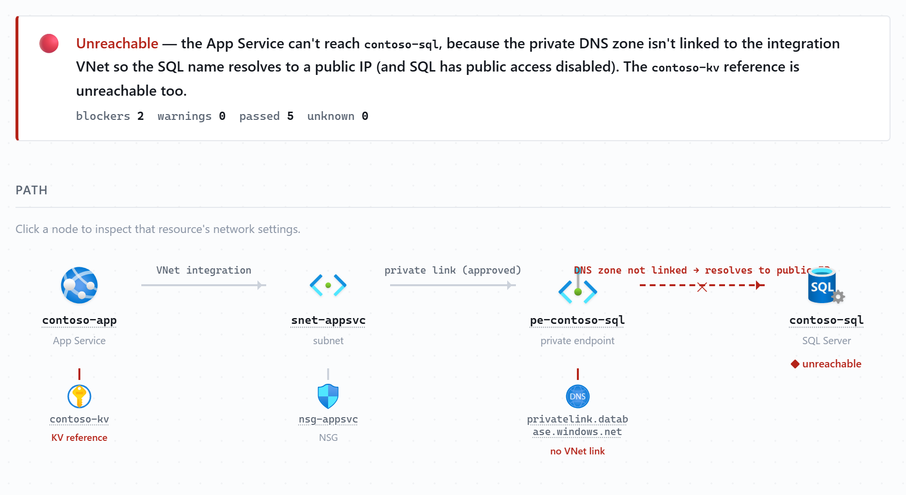
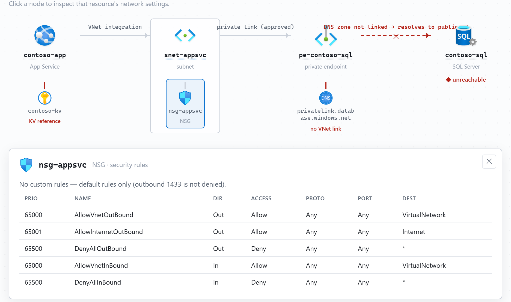

# azure-nettrace

English · [日本語](README.ja.md)

> Status: work in progress 🚧

A Claude Code Agent Skill and GitHub Copilot custom agent that traces the network
connectivity of a single Azure resource and renders it as an interactive HTML report —
a wired path diagram with official Azure icons, a list of reachability blockers, and a
click-to-inspect panel for every resource.

It runs in [Claude Code](https://claude.com/claude-code) and [GitHub
Copilot](https://github.com/features/copilot) from one shared diagnostic knowledge base;
only the entry point differs (see [Install](#install)).

Give it one resource name (an App Service, VM, AKS cluster, Function App, SQL server,
Storage account, APIM instance, …) and it walks:

```text
resource → VNet integration subnet → NSG / route table (UDR)
        → private endpoints → private DNS zones (VNet links)
        → inferred outbound targets (from app settings / connection strings / Key Vault references)
        → target-side firewalls (networkAcls / publicNetworkAccess / DB firewall rules)
```

…and tells you not just *what* is connected, but *why* a connection may be broken — a
missing private DNS VNet link, an NSG deny, an unapproved private endpoint, a database
firewall that doesn't allow the integration subnet, and so on.

## What it looks like

The report opens the answer first — can the resource reach its target, and if not, the
root cause — above a left-to-right path diagram with the broken hop drawn in red:

<picture>
  <source media="(prefers-color-scheme: dark)" srcset="docs/images/report-overview-en-dark.png">
  
</picture>

Click any resource in the diagram to inspect its network settings in place — here the NSG
opens its security-rule table, so you can check a suspected block without leaving the page:

<picture>
  <source media="(prefers-color-scheme: dark)" srcset="docs/images/report-inspect-en-dark.png">
  
</picture>

▶ Try the interactive report (sanitized `contoso-*` demo, same RF-04 + RF-06 case):
<https://yukurash.github.io/azure-nettrace/demo/en/> — click any node to open its settings.

## Why another visualizer?

Existing tools ([azure-resource-visualizer](https://github.com/microsoft/azure-skills),
Network Watcher topology) draw a whole resource group or network. This one answers a
narrower question — "why can't *this* resource reach *that* one?" — by combining a
single-resource walk, connection-target inference, and reachability diagnostics into one
report.

## Highlights

- Verdict first: one plain sentence saying whether the resource reaches its target, and the root cause if it doesn't.
- A wired path diagram, optionally with the official Microsoft Azure icons, with any broken hop shown in red.
- Click a resource to inspect its network settings — NSG rules, subnet config, private-endpoint state, DNS VNet links, SQL/Storage firewalls, and more.
- Around 20 resource types have dedicated adapters (App Service, Functions, VM, AKS, Container Apps, SQL/PG/MySQL, Storage/Key Vault/Cosmos, Redis, Service Bus/Event Hubs, ACR, AI Search, Foundry, API Management, Application Gateway, Front Door, Azure Firewall, Data Factory/Synapse, …); any other type traces via a generic fallback.
- Output in `en` or `ja`, light/dark aware, fully self-contained (no internet needed to view).

## Requirements

- Claude Code or GitHub Copilot (VS Code, agent mode)
- Azure CLI ≥ 2.60 signed in (`az login`), with the `resource-graph` extension
- The [Azure MCP server](https://github.com/Azure/azure-mcp) (recommended; it falls back
  to the plain Azure CLI if the server isn't configured)
- Reader access to the target subscription

## Install

The diagnostic logic lives once under `skills/azure-nettrace/` and is shared by both
platforms; pick the entry point for your tool.

Common Azure setup:

```bash
az login
az extension add --name resource-graph
```

### Claude Code

Link the skill into your Claude Code skills directory and register the Azure MCP server:

```powershell
# Windows
New-Item -ItemType Junction -Path "$HOME\.claude\skills\azure-nettrace" `
  -Target "<repo>\skills\azure-nettrace"
```

```bash
# macOS / Linux
ln -s "<repo>/skills/azure-nettrace" "$HOME/.claude/skills/azure-nettrace"

claude mcp add azure -- npx -y @azure/mcp@latest server start --read-only
```

Then ask Claude Code:

> trace the network connectivity of `<your-app-service-name>`

### GitHub Copilot

Open the repository in VS Code. The custom agent, prompt and MCP server ship with the
repo, so there's nothing to link:

- `.github/agents/azure-nettrace.agent.md` — the custom agent (pick it in the Chat view's
  mode selector; older VS Code builds read it as `.chatmode.md`).
- `.github/prompts/azure-nettrace.prompt.md` — a `/azure-nettrace` prompt for a one-shot run.
- `.vscode/mcp.json` — registers the read-only Azure MCP server; start it from the MCP view,
  or let agent mode start it.

Then, in Copilot Chat (agent mode), run the prompt or ask:

> /azure-nettrace — or — trace the network connectivity of `<your-app-service-name>`

## Output

By default the tool writes a self-contained interactive HTML report to `out/`; open it in
a browser (light/dark aware, no internet needed). It contains a verdict band, the path
diagram, a red-flag panel and a dependency table, and every node (or a branch such as an
NSG) is clickable to reveal that resource's network settings.

Options:

- `lang` — `en` or `ja` (the tool asks if you don't say).
- `format` — `html` (default) or `markdown` (inline Mermaid + tables).
- `iconStyle` — `builtin` (default, license-safe icons) or `official`. To use the official
  Microsoft Azure architecture icons, download the set into
  `skills/azure-nettrace/assets/azure-icons/` (gitignored) and pass `iconStyle: official` —
  see [`references/output-html.md`](skills/azure-nettrace/references/output-html.md).

`assets/report-template.html` is a runnable reference report you can open directly.

## Examples

See [`examples/`](examples/) for sanitized sample output:

- [healthy trace](examples/appservice-to-sql-healthy.md) — 0 blockers
- [broken private DNS](examples/appservice-to-sql-broken-dns.md) — 🔴 RF-04, the classic
  "the private endpoint is set up but it still can't connect" case

You can reproduce them with the [test environment](test-infra/).

## Security

Secrets in traced configuration are masked in the output. The official Azure icon set is
never committed (it's gitignored). Every push and PR is scanned for secrets (gitleaks),
and the examples are fully sanitized.

## License

MIT
