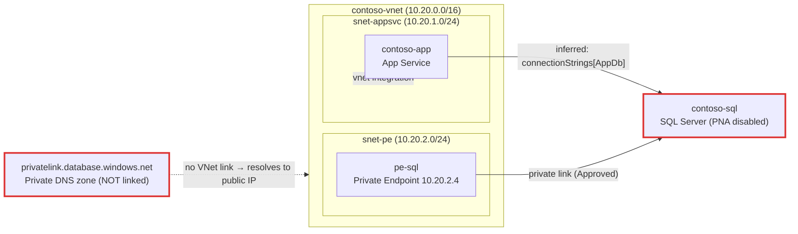

# Connectivity trace: contoso-app (App Service)

> 🔒 Secrets in configuration values are masked. This output still contains
> resource names and private IPs — handle accordingly.
> Generated 2026-07-08 · subscription: 00000000… · read-only trace

> _Sanitized example. Generated from a live trace of the `test-infra` environment
> with `breakScenario=missingDnsLink` (the private DNS zone's VNet link removed)._

## Diagram



## Dependencies

| # | Hop | Resource | Type | Key facts | Confidence | Evidence |
|---|-----|----------|------|-----------|------------|----------|
| 1 | source | contoso-app | App Service | vnetRouteAll=true | — | — |
| 2 | egress subnet | snet-appsvc | Subnet | NSG=nsg-appsvc, deleg=Microsoft.Web/serverFarms | — | — |
| 3 | target | contoso-sql | SQL Server | PNA=Disabled, PE=Approved@snet-pe | confirmed | connectionStrings["AppDb"] |
| 4 | dns | privatelink.database.windows.net | Private DNS zone | **0 VNet links to source VNet** | — | — |

## Red flags

### 🔴 RF-04 — privatelink.database.windows.net is not linked to contoso-vnet
- **facts**: the zone exists and the private endpoint has a DNS zone group, but the
  zone has **no VNet link** to the source VNet (contoso-vnet)
- **effect**: `contoso-sql.database.windows.net` resolves to its **public** IP from this
  VNet; with `publicNetworkAccess=Disabled` the connection is refused — even though the
  private endpoint itself is healthy and Approved
- **fix**:
  ```bash
  az network private-dns link vnet create -g <rg> \
    -z privatelink.database.windows.net -n link-contoso \
    --virtual-network <vnetId> --registration-enabled false
  ```

✅ passed: RF-01, RF-02, RF-03, RF-05, RF-06, RF-07, RF-08, RF-09, RF-10, RF-11, RF-12

> This is the classic "private endpoint is set up but it still can't connect" case —
> the endpoint is fine; DNS is the missing link.
