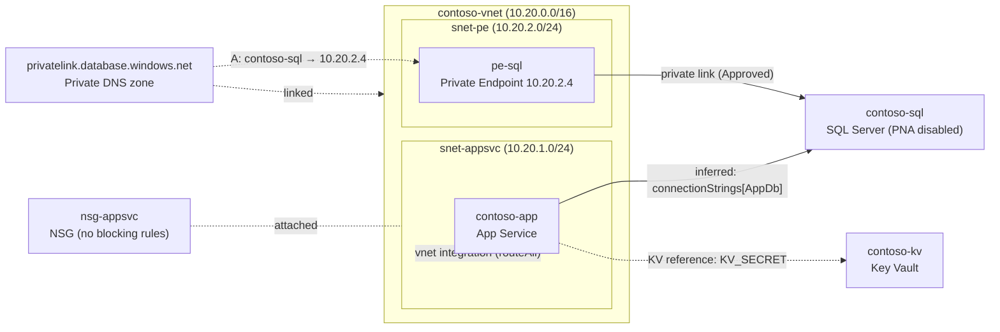

# Connectivity trace: contoso-app (App Service)

> 🔒 Secrets in configuration values are masked. This output still contains
> resource names and private IPs — handle accordingly.
> Generated 2026-07-08 · subscription: 00000000… · read-only trace

> _Sanitized example. Real resource names → `contoso-*`, GUIDs zeroed, generated
> from a live trace of the `test-infra` baseline (`breakScenario=none`)._

## Diagram

## Dependencies

| # | Hop | Resource | Type | Key facts | Confidence | Evidence |
|---|-----|----------|------|-----------|------------|----------|
| 1 | source | contoso-app | App Service | vnetRouteAll=true, PNA=Enabled | — | — |
| 2 | egress subnet | snet-appsvc | Subnet | NSG=nsg-appsvc, UDR=none, deleg=Microsoft.Web/serverFarms | — | — |
| 3 | target | contoso-sql | SQL Server | PNA=Disabled, PE=Approved@snet-pe | confirmed | connectionStrings["AppDb"] |
| 4 | dep | contoso-kv | Key Vault | referenced for a secret | inferred | appSettings["KV_SECRET"] |
| 5 | dns | privatelink.database.windows.net | Private DNS zone | linked to contoso-vnet | — | — |

## Red flags

✅ passed: RF-01, RF-02, RF-03, RF-04, RF-05, RF-06, RF-07, RF-08, RF-09, RF-10, RF-11, RF-12

No reachability blockers found. The App Service reaches contoso-sql over the private
endpoint; the private DNS zone is linked to the source VNet so the SQL FQDN resolves to
the private IP `10.20.2.4`.

> ⚪ Note: the `contoso-sql` password is delivered via a Key Vault reference; the secret
> value was not read (masked by policy).
