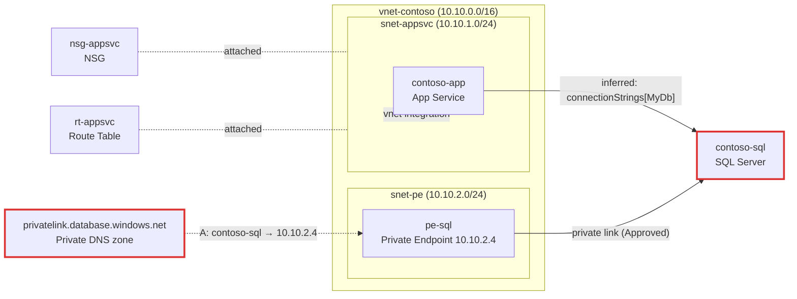

# Output template

The trace produces **one Markdown artifact**. Sections in this order, nothing else.

## 0. Header + masking notice (always)

```markdown
# Connectivity trace: {resource name} ({short type})

> 🔒 Secrets in configuration values are masked. This output still contains
> resource names and private IPs — handle accordingly.
> Generated {date} · subscription: {first 8 chars}… · read-only trace
```

(Subscription shown truncated — never the full GUID in a shareable artifact.)

## 1. Mermaid diagram

### Node ID rules (prevents broken diagrams)
- Node IDs: lowercase alphanumeric + underscore only (`app1`, `snet_appsvc`, `sql1`).
  Derive from resource names by stripping non-alphanumerics; dedupe with suffixes.
- Labels: always double-quoted; put the type on a second line with `<br/>`.
- Red-flagged elements: append `:::red` (blockers) or `:::warn` (warnings).

### Template



Edge label conventions: `inferred: {evidence}` for Phase-3 edges,
`private link ({status})` for PE edges, `-.->` for DNS/association edges.

## 2. Dependency table

| # | Hop | Resource | Type | Key facts | Confidence | Evidence |
|---|-----|----------|------|-----------|------------|----------|
| 1 | source | contoso-app | App Service | vnetRouteAll=true, PNA=Enabled | — | — |
| 2 | egress subnet | snet-appsvc | Subnet | NSG=nsg-appsvc, UDR=rt-appsvc, deleg=Microsoft.Web/serverFarms | — | — |
| 3 | target | contoso-sql | SQL Server | PNA=Disabled, PE=Approved | confirmed | connectionStrings["MyDb"] |

Facts column: only the fields red flags used or a reader needs. No property dumps.

## 3. Red flags

Order: 🔴 → 🟡 → ⚪. ✅ rules go in a single summary line at the end.

```markdown
### 🔴 RF-04 — privatelink.database.windows.net is not linked to vnet-contoso
- **facts**: zone has 2 VNet links; none match the source VNet
- **effect**: contoso-sql.database.windows.net resolves to its public IP from this
  VNet; with publicNetworkAccess=Disabled the connection is refused
- **fix**: `az network private-dns link vnet create -g {rg} -z privatelink.database.windows.net -n link-contoso --virtual-network {vnetId} --registration-enabled false`

### ⚪ Unverified
- RF-03: route table readable but NVA policy is out of ARM scope
- Q12 skipped: no permission to read app settings (need Website Contributor / list perms)

✅ passed: RF-01, RF-02, RF-05, RF-06, RF-07, RF-08, RF-09, RF-10, RF-11, RF-12
```

## 4. Optional appendix

Only when the user asks for detail: full NSG rule table for the traced ports,
peering matrix, all VNet links of each zone.

## Sanitized-example rule

When an artifact is saved under `examples/`, it must additionally pass
`scripts/sanitize.ps1` (zeroed GUIDs, `contoso-*` names) + manual review.
